# VGGT Model Flow and Task Mapping

## Complete Model Architecture and Task Flow

```mermaid
graph TB
    %% Input Processing
    subgraph "Input Processing"
        A["Raw Images<br/>Variable sizes"] --> B["load_and_preprocess_images()"]
        B --> C["Preprocessed Images<br/>[S, 3, 518, 518]"]
        C --> D["Add Batch Dimension<br/>[B, S, 3, H, W]<br/>B=1, S=sequence length"]
    end

    %% VGGT Model Core
    subgraph "VGGT Model Core"
        D --> E["Aggregator<br/>(Alternating Attention)"]
        
        subgraph "Aggregator Details"
            E1["Patch Embedding<br/>[B×S, P, C]<br/>P=(H/14)×(W/14), C=1024"]
            E2["Special Tokens<br/>Camera + Register<br/>[B×S, 1+R+P, C]"]
            E3["Alternating Attention<br/>Frame ↔ Global<br/>24 blocks"]
            E4["Aggregated Tokens List<br/>[B, S, P, 2C]<br/>24 tensors"]
            
            E1 --> E2 --> E3 --> E4
        end
        
        E --> E4
    end

    %% Prediction Heads
    subgraph "Prediction Heads"
        E4 --> F1["Camera Head<br/>📷"]
        E4 --> F2["Depth Head<br/>📏"]
        E4 --> F3["Point Head<br/>🎯"]
        E4 --> F4["Track Head<br/>🔄"]
        
        %% Camera Head Details
        subgraph "Camera Head Architecture"
            F1a["Camera Tokens Only<br/>[B, S, C]"]
            F1b["Transformer Trunk<br/>4 blocks + iterative refinement"]
            F1c["Pose Branch<br/>MLP"]
            F1a --> F1b --> F1c
        end
        F1 --> F1a
        
        %% Depth Head Details  
        subgraph "Depth Head Architecture"
            F2a["All Patch Tokens<br/>[B, S, P, 2C]"]
            F2b["Multi-scale DPT<br/>layers [4,11,17,23]"]
            F2c["Feature Fusion<br/>RefineNet blocks"]
            F2d["Dense Prediction<br/>Conv layers"]
            F2a --> F2b --> F2c --> F2d
        end
        F2 --> F2a
        
        %% Point Head Details
        subgraph "Point Head Architecture"  
            F3a["All Patch Tokens<br/>[B, S, P, 2C]"]
            F3b["Multi-scale DPT<br/>layers [4,11,17,23]"]
            F3c["Feature Fusion<br/>RefineNet blocks"]
            F3d["Dense Prediction<br/>Conv layers"]
            F3a --> F3b --> F3c --> F3d
        end
        F3 --> F3a
        
        %% Track Head Details
        subgraph "Track Head Architecture"
            F4a["DPT Feature Extractor<br/>down_ratio=2"]
            F4b["BaseTrackerPredictor<br/>Correlation + UpdateFormer"]
            F4c["Query Points Input<br/>[B, N, 2]"]
            F4a --> F4b
            F4c --> F4b
        end
        F4 --> F4a
    end

    %% Head Outputs
    subgraph "Head Outputs"
        F1c --> G1["Pose Encoding<br/>[B, S, 9]<br/>T(3) + Quat(4) + FoV(2)"]
        F2d --> G2["Depth + Confidence<br/>[B, S, H, W, 1]<br/>[B, S, H, W]"]
        F3d --> G3["World Points + Confidence<br/>[B, S, H, W, 3]<br/>[B, S, H, W]"]
        F4b --> G4["Tracks + Vis + Conf<br/>[B, S, N, 2]<br/>[B, S, N] × 2"]
    end

    %% Post-processing
    subgraph "Post-processing"
        G1 --> H1["pose_encoding_to_extri_intri()<br/>Camera Matrices<br/>Extrinsic [B, S, 3, 4]<br/>Intrinsic [B, S, 3, 3]"]
        G2 --> H2["Depth Maps<br/>[S, H, W, 1]<br/>activation: exp"]
        G3 --> H3["World Points<br/>[S, H, W, 3]<br/>activation: inv_log"]
        G4 --> H4["Point Trajectories<br/>[S, N, 2]<br/>Visibility [S, N]<br/>Confidence [S, N]"]
        
        H1 --> H5["unproject_depth_map_to_point_map()<br/>Depth → 3D Points<br/>[S, H, W, 3]"]
        H2 --> H5
    end

    %% Task Applications
    subgraph "Task Applications"
        %% Task 1: Interactive Visualization
        subgraph "Task 1: Interactive 3D Visualization<br/>(demo_gradio.py)"
            T1["Heads Used:<br/>📷 Camera + 📏 Depth + 🎯 Point"]
            T1a["Two Modes Available:"]
            
            %% Mode 1 Details
            subgraph "Mode 1: Depthmap and Camera Branch"
                T1b1["Inputs:<br/>• Pose encoding [S, 9]<br/>• Depth maps [S, H, W, 1]<br/>• Image shape (H, W)"]
                T1b2["Processing:<br/>pose_encoding_to_extri_intri()<br/>→ extrinsic [S, 3, 4]<br/>→ intrinsic [S, 3, 3]"]
                T1b3["unproject_depth_map_to_point_map()<br/>→ world_points [S, H, W, 3]"]
                T1b1 --> T1b2 --> T1b3
            end
            
            %% Mode 2 Details
            subgraph "Mode 2: Pointmap Branch"
                T1c1["Inputs:<br/>• World points [S, H, W, 3]<br/>• Point confidence [S, H, W]"]
                T1c2["Direct Usage:<br/>predictions['world_points']<br/>No unprojection needed"]
                T1c1 --> T1c2
            end
            
            T1d["Output: GLB 3D Scene<br/>predictions_to_glb()<br/>• 3D point cloud<br/>• Camera frustums<br/>• Confidence filtering"]
            
            T1 --> T1a
            T1a --> T1b1
            T1a --> T1c1
            T1b3 --> T1d
            T1c2 --> T1d
        end
        
        %% Task 2: Professional Visualization
        subgraph "Task 2: Professional Visualization<br/>(demo_viser.py)"
            T2["Heads Used:<br/>📷 Camera + 📏 Depth + 🎯 Point"]
            
            %% Default Mode
            subgraph "Default Mode: Depth-based"
                T2a1["Inputs:<br/>• Depth maps [S, H, W, 1]<br/>• Depth confidence [S, H, W]<br/>• Extrinsic [S, 3, 4]<br/>• Intrinsic [S, 3, 3]"]
                T2a2["unproject_depth_map_to_point_map()<br/>→ world_points [S, H, W, 3]"]
                T2a1 --> T2a2
            end
            
            %% Alternative Mode
            subgraph "Alternative Mode: --use_point_map"
                T2b1["Inputs:<br/>• World points [S, H, W, 3]<br/>• Point confidence [S, H, W]"]
                T2b2["Direct Usage:<br/>world_points = world_points_map<br/>conf = conf_map"]
                T2b1 --> T2b2
            end
            
            T2c["Output: Viser 3D Server<br/>• Interactive point cloud<br/>• Clickable camera frustums<br/>• Real-time filtering"]
            
            T2 --> T2a1
            T2 --> T2b1
            T2a2 --> T2c
            T2b2 --> T2c
        end
        
        %% Task 3: Production Export
        subgraph "Task 3: Production Export<br/>(demo_colmap.py)"
            T3["Heads Used:<br/>📷 Camera + 📏 Depth + 🔄 Track"]
            
            %% Mode 1: Feedforward
            subgraph "Mode 1: Feedforward Only (--no-use_ba)"
                T3a1["Inputs:<br/>• Extrinsic [S, 3, 4]<br/>• Intrinsic [S, 3, 3]<br/>• Images [S, 3, H, W]"]
                T3a2["batch_np_matrix_to_pycolmap_wo_track()<br/>→ cameras_colmap<br/>→ images_colmap"]
                T3a1 --> T3a2
            end
            
            %% Mode 2: Bundle Adjustment
            subgraph "Mode 2: Bundle Adjustment (--use_ba)"
                T3b1["Initial Inputs:<br/>• Extrinsic [S, 3, 4]<br/>• Intrinsic [S, 3, 3]<br/>• Depth maps [S, H, W, 1]"]
                T3b2["Keypoint Extraction:<br/>extract_keypoints()<br/>→ query_points [N, 2]"]
                T3b3["VGGSfM Tracking:<br/>predict_tracks()<br/>→ tracks [S, N, 2]<br/>→ vis_score [S, N]<br/>→ conf_score [S, N]"]
                T3b4["Bundle Adjustment:<br/>run_bundle_adjustment()<br/>→ refined cameras<br/>→ refined 3D points"]
                T3b1 --> T3b2 --> T3b3 --> T3b4
            end
            
            T3c["Output: COLMAP Format<br/>• cameras.bin<br/>• images.bin<br/>• points3D.bin<br/>• sparse.ply"]
            
            T3 --> T3a1
            T3 --> T3b1
            T3a2 --> T3c
            T3b4 --> T3c
        end
    end

    %% Connections to Tasks
    H1 --> T1
    H2 --> T1
    H3 --> T1
    H5 --> T1
    
    H1 --> T2
    H2 --> T2
    H3 --> T2
    H5 --> T2
    
    H1 --> T3
    H2 --> T3
    H4 --> T3

    %% Styling
    classDef inputNode fill:#e1f5fe
    classDef headNode fill:#f3e5f5
    classDef outputNode fill:#e8f5e8
    classDef taskNode fill:#fff3e0
    
    class A,B,C,D inputNode
    class F1,F2,F3,F4,E headNode
    class G1,G2,G3,G4,H1,H2,H3,H4,H5 outputNode
    class T1,T2,T3,T1d,T2b,T3c taskNode
```

## Head Usage Summary by Task and Mode

### Task 1: Interactive 3D Visualization (`demo_gradio.py`)

| **Mode** | **Inputs** | **Processing** | **Outputs** |
|----------|------------|----------------|-------------|
| **Depthmap and Camera Branch** | • Pose encoding `[S, 9]` • Depth maps `[S, H, W, 1]` • Image shape `(H, W)` | `pose_encoding_to_extri_intri()` → `unproject_depth_map_to_point_map()` | World points `[S, H, W, 3]` |
| **Pointmap Branch** | • World points `[S, H, W, 3]` • Point confidence `[S, H, W]` | Direct usage from predictions | World points `[S, H, W, 3]` |

### Task 2: Professional Visualization (`demo_viser.py`)

| **Mode** | **Inputs** | **Processing** | **Outputs** |
|----------|------------|----------------|-------------|
| **Default (Depth-based)** | • Depth maps `[S, H, W, 1]` • Depth confidence `[S, H, W]` • Extrinsic `[S, 3, 4]` • Intrinsic `[S, 3, 3]` | `unproject_depth_map_to_point_map()` | World points `[S, H, W, 3]` |
| **--use_point_map** | • World points `[S, H, W, 3]` • Point confidence `[S, H, W]` | Direct usage from predictions | World points `[S, H, W, 3]` |

### Task 3: Production Export (`demo_colmap.py`)

| **Mode** | **Inputs** | **Processing** | **Outputs** |
|----------|------------|----------------|-------------|
| **Feedforward Only** | • Extrinsic `[S, 3, 4]` • Intrinsic `[S, 3, 3]` • Images `[S, 3, H, W]` | `batch_np_matrix_to_pycolmap_wo_track()` | COLMAP format files |
| **Bundle Adjustment (--use_ba)** | • Extrinsic `[S, 3, 4]` • Intrinsic `[S, 3, 3]` • Depth maps `[S, H, W, 1]` | Keypoint extraction → VGGSfM tracking → Bundle adjustment | Refined COLMAP format |

## Overall Head Usage by Task

| **Task** | **Demo** | **Camera Head** | **Depth Head** | **Point Head** | **Track Head** | **Output Format** |
|----------|----------|----------------|----------------|----------------|----------------|-------------------|
| **Interactive 3D Visualization** | `demo_gradio.py` | ✅ Pose estimation | ✅ Dense depth (primary) | ✅ Direct 3D (alternative) | ❌ | GLB 3D scene |
| **Professional Visualization** | `demo_viser.py` | ✅ Pose estimation | ✅ Dense depth (default) | ✅ Direct 3D (optional) | ❌ | Viser server |
| **Production Export** | `demo_colmap.py` | ✅ Initial poses | ✅ Depth maps | ❌ | ✅ Bundle adjustment | COLMAP format |

## Data Flow Dimensions Summary

### Input Dimensions
- **Raw images**: Variable sizes
- **Preprocessed**: `[S, 3, 518, 518]` where S = sequence length
- **Model input**: `[B, S, 3, H, W]` where B = batch size (usually 1)

### Aggregator Dimensions  
- **Patch tokens**: `[B×S, P, C]` where P = (H/14)×(W/14), C = 1024
- **With special tokens**: `[B×S, 1+R+P, C]` where R = register tokens (4)
- **Aggregated output**: `[B, S, P, 2C]` (frame + global features)

### Head Output Dimensions
- **Camera**: `[B, S, 9]` → pose encoding (T + quat + FoV)
- **Depth**: `[B, S, H, W, 1]` + confidence `[B, S, H, W]`
- **Point**: `[B, S, H, W, 3]` + confidence `[B, S, H, W]`  
- **Track**: `[B, S, N, 2]` + visibility `[B, S, N]` + confidence `[B, S, N]`

### Key Relationships
1. **Camera + Depth** → 3D points via unprojection (most common)
2. **Point Head** → Direct 3D regression (alternative to depth)
3. **Track Head** → Used for bundle adjustment in production pipeline
4. **All heads** can work together for comprehensive 3D understanding